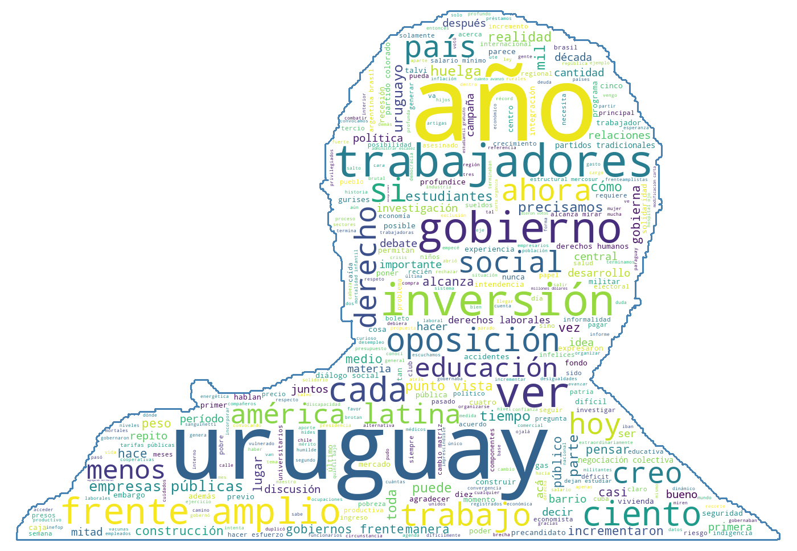

# Simple NLP

Proyecto Python utilizado para realizar Procesamiento de Lenguaje Natural (NLP por sus siglas en inglés) de forma básica mediante la librería NLTK.

## Dependencias

Para ejecutar estos scripts es necesario tener instaladas estas librerías.

- [NLTK](https://www.nltk.org/install.html)
- [word_cloud](https://amueller.github.io/word_cloud/)

## Tokenización

El procesamiento de texto realiza las siguientes acciones:

1. Separa todo el texto en palabras.
1. Las pasa todas a minúsculas.
1. Si se envió el parámetro `stem`, se reducen las palabras a su raíz lingüística
1. Remueve puntuaciones y todo caracter no alfanumérico
1. Filtra las STOPWORDS del idioma español

## Ejemplos procesados

Se puede ver el trabajo realizado con este proyecto en la carpeta [examples/andrade-vs-talvi](./examples/andrade-vs-talvi).

- En `wordcount`
  - El conteo de palabras en los archivos, ya sea reducidas a su raíz `-raiz.txt` o no.
  - Ese mismo conteo ordenado a modo ranking en `-rank.txt`.
- En `wordcloud` las últimas nubes generadas con las siluetas de cada precandidato

Las nubes de palabras quedan de la siguiente manera:

### Oscar Andrade



### Ernesto Talvi


## Ejemplo de uso

```bash
# Tokenizar el texto.
# Busca el input en la carpeta `input`
# Genera el archivo final en la carpeta `ouput`
python3 parse.py -i input/andrade.txt

# Si se quiere obtener las raíces de las palabras unicamente
# se utiliza el parametro `--root|-r`
python3 parse.py -i input/andrade.txt --root

# Si se quiere realizar el analisis de sentimiento de las frases
python3 sentiment.py -i input/andrade.txt

# Sumarizacion de texto
# Frases destacadas
python3 summary.py -i input/andrade.txt

# Conteo de palabras ordenadas alfabeticamente
# Busca el input en la carpeta `ouput` generada con parse.py
python3 count.py -i output/andrade.txt

# Ranking de palabras mas usadas
# Busca el input en la carpeta `ouput` generada con parse.py
python3 count.py -i output/andrade.txt --rank

# Armar la nube de palabras
# Busca el input en la carpeta `ouput` generada con parse.py
python3 cloud.py -i output/andrade.txt

# Armar la nube de palabras utilizando una mascara
# Busca el input en la carpeta `ouput` generada con parse.py
python3 cloud.py -i output/andrade.txt -m input/andrade.png

# ONE-LINE-COMMAND
FILE=andrade && python3 parse.py -i $FILE.txt -o $FILE.txt && python3 count.py -i $FILE.txt -o $FILE.txt && python3 count.py -i $FILE.txt -o $FILE-rank.txt --rank && python3 summary.py -i $FILE.txt -o $FILE.txt && python3 cloud.py -i $FILE.txt -o $FILE.png
```

## Pedidos y sugerencias

Por cualquier pedido o sugerencia, [crear un issue en este mismo repositorio](https://github.com/nahuelhds/votaciones-diputados-argentina/issues/new).

## Colaboraciones

Si te interesa colaborar (por ejemplo, subiendo esta misma información en otro formato de utilidad) idealmente podés hacerlo a través de un PR (Pull Request). Si no, contactate conmigo para ver otras formas de recibir sus colaboraciones.

# nahuelhds

Segui mi actividad en:

- Medium: [@nahuelhds](http://medium.com/@nahuelhds)
- Twitter: [@nahuelhds](https://twitter.com/nahuelhds)

Si te gusta lo que hago y querés darme una mano:

- Podés [invitarme un café en Ko-Fi](https://ko-fi.com/nahuelhds)
- O también [dándome apoyo en Patreon](https://www.patreon.com/nahuelhds)
